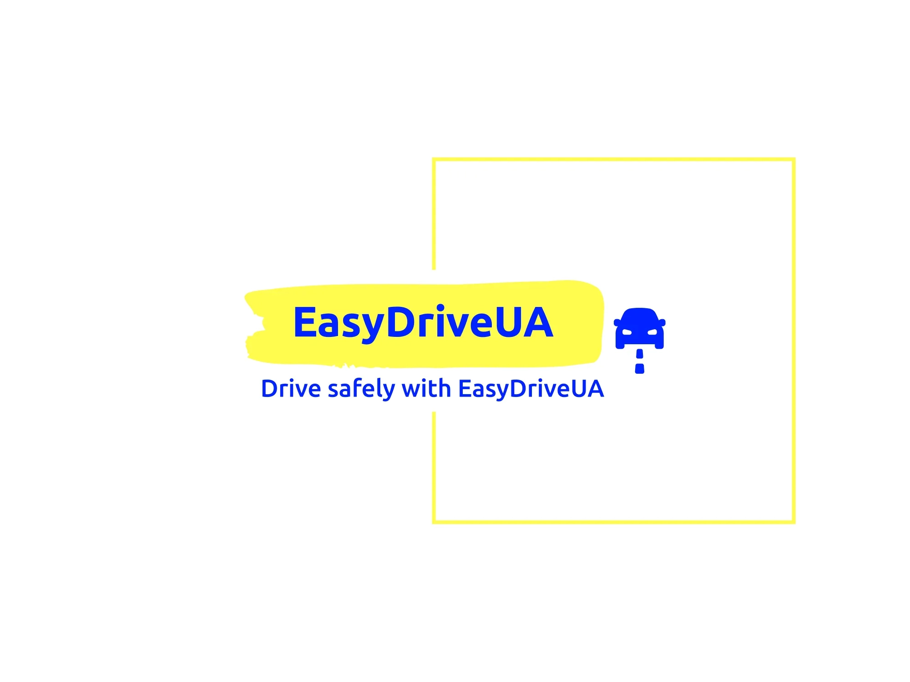
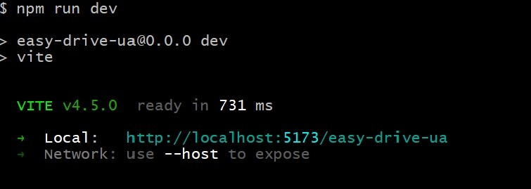

<p align="center">
 
</p>
<h3 align="center">Wellcome to EasyDriveUA</h3>

<div align="center">

[]()
[](https://github.com/mykytapokasiuk/easy-drive-ua/issues)
[](https://github.com/mykytapokasiuk/easy-drive-ua/pulls)

</div>

---

## 📝 Table of Contents

- [About](#about)
- [Built Using](#built_using)
- [Getting Started](#getting_started)
- [Usage](#usage)
- [Deployment](#deployment)
- [Authors](#authors)

## 🧐 About <a name = "about"></a>

An application has been developed for a company that offers car rental services
in Ukraine.

## 🔨 Built Using <a name = "built_using"></a>

- Vite
- React
- React Router
- Redux Toolkit
- React Bootstrap
- CSS
- MockAPI

## 🏁 Getting Started <a name = "getting_started"></a>

These instructions will guide you through setting up the project on your local
machine for development purposes. See [deployment](#deployment) for notes on how
to deploy the project on a live system.

### Prerequisites

What things you need to install the software.

```
You need to install Node, NPM, and Git on your machine.
```

### Installing

A step by step series of examples that tell you how to get a development env
running.

```
- git clone https://github.com/mykytapokasiuk/easy-drive-ua
- npm install - install the base project dependencies
- cd easy-drive-ua
- To start a development server on your machine, use the following command: "npm run dev". The server will be launched on port 5173.
```



## 🎈 Usage <a name ="usage"></a>

- The application consists of 3 pages:
  - A homepage with a menu
  - A page displaying a catalog of cars with filters for brand, rental price per
    year, and mileage.
  - A page with ads that have been added to favorites by the user
- Possibility to clear one or all the filters
- A modal window that displays detailed information about the car and its rental
  conditions.

## 🚀 Deployment <a name = "deployment"></a>

Add additional notes about how to deploy this on a live system.

- The production version of the project will be automatically built and deployed
  to GitHub Pages, in the gh-pages branch, every time the main branch is
  updated. For example, after a direct push or an accepted pull request. To do
  this, you need to edit the base field in the vite.config.js file, replacing it
  with your repository name "/your_repo_name", and send the changes to GitHub.

- Next, you need to go to the settings of the GitHub repository (Settings >
  Pages) and expose the distribution of the production version of the files from
  the /root folder of the gh-pages branch, if this was not done automatically.


## ✍️ Authors <a name = "authors"></a>

- [@mykytapokasiuk](https://github.com/mykytapokasiuk) - GitHub

## 🤝 Show your support

Give a ⭐️ if this project helped you!

---
